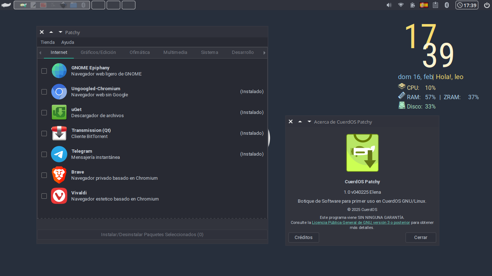

# Patchy

<p align="center">
  
</p>

<p align="center">
  
</p>

**Patchy** es una minitienda o botique de software de primer uso en **CuerdOS GNU/Linux**. Con una interfaz gráfica amigable basada en **Python 3**, **GTK** y **Qt**, permite instalar aplicaciones recomendadas por el equipo de CuerdOS.

## Características

- **Interfaz intuitiva y amigable**: Fácil de usar para principiantes, permitiendo una experiencia de usuario fluida desde el primer momento.
- **Integración con CuerdOS GNU/Linux**: Perfectamente adaptada al entorno de escritorio y las herramientas de **CuerdOS**, garantizando una experiencia coherente.
- **Fácil instalación y configuración**: Ofrece opciones de instalación rápida a través de paquetes **.deb**.
- **Acceso rápido a aplicaciones**: Permite instalar y gestionar aplicaciones desde una sola interfaz sin complicaciones.
- **Dependencias gestionadas**: Se asegura de que las dependencias necesarias estén listas para su instalación, minimizando errores y problemas.
- **Personalización y extensibilidad**: Puedes modificar el código para ajustarlo a tus necesidades, brindando mayor control sobre la instalación de software.
- **Diseño modular**: Estructura organizada que permite añadir más aplicaciones o módulos en el futuro de forma sencilla.
- **Compatible con entornos de escritorio populares**: Funciona perfectamente en entornos como **KDE Plasma**, **Xfce**, **Cinnamon**, **MATE** y **GNOME**.
- **Completamente gratuito y de código abierto**: Totalmente basado en software libre, garantizando transparencia y libertad para los usuarios.

## Requisitos

- **CuerdOS GNU/Linux**
- **Python 3.x**
- **GTK 3.0** o **Qt 5+**
- **Nala**

## Instalación

Clona el repositorio y ejecuta la aplicación:

```bash
git clone https://github.com/gatoverde95/Patchy.git
cd Patchy
python3 patchy.py
```

## Uso

1. Ejecuta `python3 patchy.py`.
2. Busca una aplicación.
3. Le das a Instalar y proporciona tu contraseña (No registra contraseñas).
4. Esperas a que el programa se encuentre instalado y listo.

## Contribuir

Si deseas colaborar en el desarrollo de **Patchy**, síguenos en [GitHub](https://github.com/gatoverde95/Patchy) y envía tus **Pull Requests** o reporta errores en la sección de **Issues**.

## Licencia

Este proyecto está licenciado bajo la **GPLv3**. Puedes consultar el archivo `LICENSE` para más información.


---

> **Autor:** [gatoverde95](https://github.com/gatoverde95)  
> **Repositorio:** [Pstchy](https://github.com/gatoverde95/Patchy)
